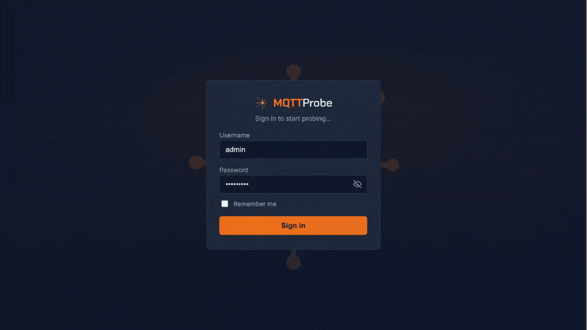
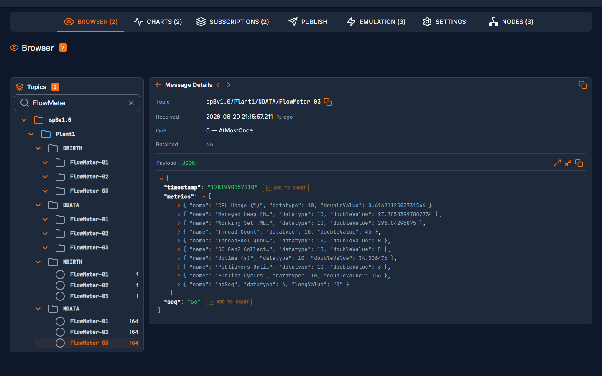

# MQTTProbe

**The MQTT diagnostic tool built for IIoT.**

Connect to any MQTT broker, browse live topic trees, inspect payloads, and chart JSON telemetry in real time. Native Sparkplug B decode and EoN node emulation built in. Open source, no cloud required.

[](https://github.com/bluegrassiot/mqttprobe/actions/workflows/ci.yml)
[](LICENSE)
[](https://dotnet.microsoft.com/download/dotnet/10.0)



## Features



- **Topic Browser** — live tree view of all topics received from the broker, with recursive hierarchy navigation
- **Payload Browser** — structured JSON viewer for message payloads, with topic/payload copy-to-clipboard
- **Subscriptions** — add and remove MQTT topic subscriptions (including wildcards) at runtime; subscriptions persist per connection and auto-resubscribe on reconnect (configurable)
- **Publish** — send messages to any topic with configurable QoS level
- **MQTT/Sparkplug B Emulator** — simulate multiple Edge Nodes publishing telemetry data at a configurable rate with and without Sparkplug B
- **Sparkplug B EoN dashboard** — live view of all Edge of Network nodes, devices, and metrics; automatically requests Birth certificates for newly discovered nodes
- **Multiple Connections** — save and switch between multiple broker configurations
- **TLS / MQTTS** — connect to brokers over TLS (port 8883) or plain MQTT (port 1883), with optional untrusted certificate override
- **WebSocket support** — connect via `ws://` or `wss://` in addition to raw TCP
- **Charts** — live time-series visualization of JSON payload fields with configurable field selection; chart configurations are saved per connection across sessions
- **Authentication** — cookie-based login with PBKDF2-SHA256 hashed passwords; first-run setup wizard, in-app password change
- **Secure credential storage** — MQTT broker passwords stored in platform-native secure storage (iOS Keychain / Android Keystore / ASP.NET Data Protection); never written in plaintext

---

## Platform Support

| Platform | How it runs |
|---------------------|----------------------------------------------------|
| **Web browser**     | Blazor Server — self-host on any machine or server |
| **Docker**          | Official `docker-compose.yml` included             |
| **iOS**             | MAUI app (built from source on macOS)              |
| **Android**         | MAUI app                                           |
| **Windows desktop** | MAUI app                                           |
| **macOS**           | MAUI app (built from source on macOS)              |

---

## Quick Start — Docker

The fastest way to get running:

```bash
git clone https://github.com/bluegrassiot/mqttprobe
cd mqttprobe
docker compose up -d
```

Open **http://localhost:8080** in your browser. On first launch you will be taken to a setup page to create your admin password.

> **Data persistence:** Config, encrypted broker passwords, and Data Protection keys are stored in a named Docker volume (`mqttprobe-config`) and survive container restarts and re-deployments.

> **Broker access without exposing ports:** MQTTProbe connects to brokers by container name on the same Docker network — no need to expose broker ports to the host or external network. If your broker (e.g., Mosquitto) is on a shared Docker network, MQTTProbe can reach it directly using the container hostname.

### Access from other machines

The quickstart compose (`docker-compose.yml`) serves plain HTTP on port 8080 — fine for the machine running Docker, but browsers on other machines will reject the `Secure` auth cookie over plain HTTP.

For LAN access from other machines, use the production compose which adds a Caddy TLS proxy:

```bash
cp .env.example .env
# Edit .env: set MQTTPROBE_HOST to the IP or hostname other machines will use
docker compose -f docker-compose.prod.yml up -d
```

Then browse **https://\<MQTTPROBE_HOST\>** from any machine on the network. Caddy issues a self-signed certificate from its own local CA — browsers will warn on first visit. To remove the warning, trust Caddy's root CA on client machines:

```bash
docker compose -f docker-compose.prod.yml cp caddy:/data/caddy/pki/authorities/local/root.crt caddy-root.crt
# Windows: certutil -addstore -user Root caddy-root.crt
```

### Connecting to a LAN broker

If you use MQTTS (TLS, port 8883) and experience connection failures on Docker Desktop for Windows, this is a known WSL2 MTU issue — `docker-compose.prod.yml` already sets `com.docker.network.driver.mtu: 1400` to work around it.

---

## Quick Start — Blazor Server (Windows / Linux / macOS)

**Prerequisites:** [.NET 10 SDK](https://dotnet.microsoft.com/download/dotnet/10.0)

```bash
cd src/MqttProbe.Web
dotnet run
```

The app starts on `https://localhost:5001`. On first launch it redirects to `/Setup` to create your password.

---

## Quick Start — MAUI (iOS / Android / Windows)

**Prerequisites:** .NET 10 SDK + MAUI workload

```bash
dotnet workload install maui
```

Open `MqttProbe.slnx` in **Visual Studio 2026** (v18.0+) and select your target platform.

> **Windows:** Enable **Developer Mode** in *Settings → System → For Developers* and check **Deploy** in *Build → Configuration Manager* before running.

---

## Configuration

On first run the app creates `config/appsettings.json` (gitignored, never committed). All settings — connections, auth, charts, emulators, and UI preferences — live in this single file:

```json
{
  "Connections": [
    {
      "Name": "My Broker",
      "Host": "192.168.1.100",
      "Port": 1883,
      "User": "mqttuser",
      "Protocol": 0,
      "ClientId": "mqttprobe_my-device",
      "WebsocketBasePath": "mqtt",
      "UseTls": false,
      "AllowUntrustedCertificate": false,
      "SubscribedTopics": []
    }
  ],
  "Auth": {
    "Username": "admin",
    "PasswordHash": ""
  },
  "Performance": {
    "MaxStoredMessages": 10000,
    "MaxMessagesPerSecond": 50000
  },
  "Ui": {
    "FontAccessible": false,
    "Theme": "dark",
    "FontFamily": "Inter",
    "AutoResubscribe": true,
    "DismissedHints": []
  },
  "ChartsByConnection": {},
  "EmulatorsByConnection": {}
}
```

Charts and emulator configurations are stored per connection, keyed by connection GUID.

> **Passwords are never stored here.** MQTT broker passwords are stored in platform-secure storage (ASP.NET Data Protection on the server, iOS Keychain / Android Keystore on MAUI). If `PasswordHash` is empty, the app redirects to `/Setup` on next start.

### Protocol values

| Value | Protocol |
|---|---|
| `0` | MQTT (TCP) |
| `1` | WebSocket |

---

## Architecture

```
MqttProbe.slnx
├── src/
│   ├── MqttProbe.Shared   # Blazor components, models, services (shared by all hosts)
│   ├── MqttProbe.Web      # ASP.NET Core web host (web + Docker)
│   └── MqttProbe.Maui     # .NET MAUI host (iOS, Android, Windows)
└── tests/
    └── MqttProbe.Tests    # NUnit + bUnit unit & component tests
```

**Key libraries:**
- [MQTTnet](https://github.com/dotnet/MQTTnet) v4 — MQTT client *(pinned to v4; see note below)*
- [MudBlazor](https://mudblazor.com) — UI component library
- [Blazor-ApexCharts](https://apexcharts.github.io/Blazor-ApexCharts/) — real-time charts
- [Blazor.Lucide](https://github.com/mrpmorris/blazor-lucide) — icon library
- [SparkplugNet](https://github.com/SeppPenner/SparkplugNet) — Sparkplug B emulator
- [Google.Protobuf](https://github.com/protocolbuffers/protobuf) + [Grpc.Tools](https://www.nuget.org/packages/Grpc.Tools) — Sparkplug B payload decoding; the C# types are generated at build time from `src/MqttProbe.Shared/Protos/sparkplug_b.proto` via `protoc` (bundled in `Grpc.Tools`, no separate install needed)
- [MessagePack-CSharp](https://github.com/MessagePack-CSharp/MessagePack-CSharp) — MessagePack payload detection and decoding
- [FluentValidation](https://docs.fluentvalidation.net/) — connection form validation
- [ASP.NET Core Data Protection](https://learn.microsoft.com/aspnet/core/security/data-protection/introduction) — server-side secret encryption

> **MQTTnet v4 note:** This project uses MQTTnet **v4** (not v5). MQTTnet v5 introduced breaking API changes and [SparkplugNet](https://github.com/SeppPenner/SparkplugNet) — the Sparkplug B library used by the emulator — depends on MQTTnet v4 and has not been updated for v5 compatibility. Upgrading to MQTTnet v5 is blocked until SparkplugNet ships a compatible release.

---

## Security

- Passwords are hashed with **PBKDF2-SHA256** (100,000 iterations, random salt, constant-time verification)
- `config/appsettings.json` is restricted to **owner read/write only** (mode 600) on Linux/macOS
- MQTT broker passwords are stored in **platform-native secure storage** — never in the config file
- Authentication cookies are `HttpOnly`, `SameSite=Strict`, and expire after 8 hours with sliding renewal
- No credentials are ever committed to the repository

---

## Docker Reference

```bash
# Start (quickstart — localhost only)
docker compose up -d

# Start (production — TLS via Caddy, LAN access)
docker compose -f docker-compose.prod.yml up -d

# View logs
docker compose logs -f

# Stop
docker compose down

# Rebuild after a code change
docker compose up --build -d
```

The container runs as a **non-root user** on port `8080` using the `mcr.microsoft.com/dotnet/aspnet:10.0-alpine` base image (~130 MB).

### Using your own reverse proxy

Remove the `caddy` service from `docker-compose.prod.yml`, point your proxy (nginx, Traefik, etc.) at port `8080`, and set the `AllowedHosts` environment variable on the app container to match your public hostname to avoid 400 responses from host filtering.

---

## Development

```bash
# Run unit + component tests
dotnet test tests/MqttProbe.Tests

# Run the web host with hot reload
dotnet watch --project src/MqttProbe.Web

# Generate a local HTML coverage report (opens automatically)
python scripts/coverage.py -open

# Check code formatting (CI enforces this)
python scripts/format-check.py

# Auto-fix formatting violations
python scripts/format-check.py --fix
```

---

## Contributing

See [CONTRIBUTING.md](CONTRIBUTING.md) for guidelines on getting started, code style, comment philosophy, and the CI pipeline.

---

## License

Apache License 2.0 — see [LICENSE](LICENSE).

Third-party components and their licenses are documented in [NOTICES](NOTICES).
