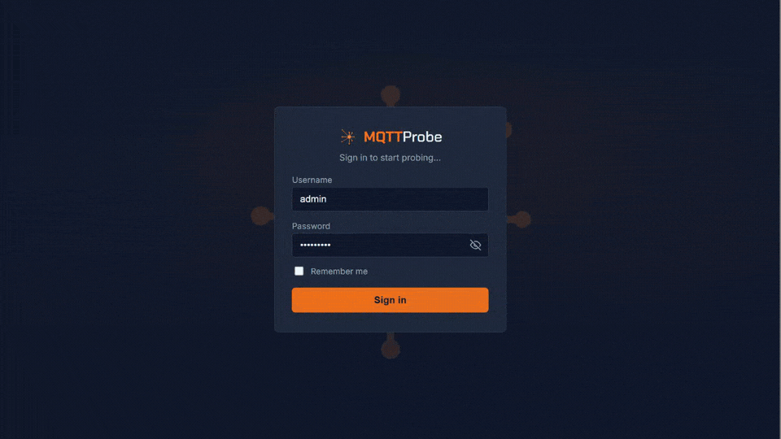
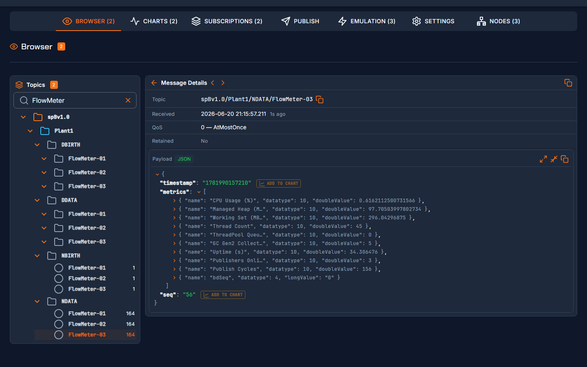

# MQTTProbe

**The MQTT diagnostic tool built for IIoT.**

Connect to any broker, browse live topics, inspect payloads, chart JSON metrics. Native Sparkplug B decode and EoN emulation. Open source, no cloud required.

[](https://github.com/bluegrassiot/mqttprobe/actions/workflows/ci.yml)
[](LICENSE)



## Highlights



- Live topic tree
- Payload browser (JSON, MessagePack, binary)
- Sparkplug B decode and EoN dashboard
- Node and MQTT emulator
- Live charts from payload fields
- Multi-connection, TLS/MQTTS, WebSocket
- Plugins (payload formats, protobuf schemas)
- Runs local: desktop, Android, Docker, web

## Get MQTTProbe

| Platform | Artifact | Notes |
|----------|----------|-------|
| Windows | [MQTTProbe-win-Setup.exe](https://github.com/bluegrassiot/mqttprobe/releases/latest/download/MQTTProbe-win-Setup.exe) | Per-user, auto-update. SmartScreen: More info, Run anyway |
| macOS | [MQTTProbe-osx-Setup.pkg](https://github.com/bluegrassiot/mqttprobe/releases/latest/download/MQTTProbe-osx-Setup.pkg) | Signed and notarized, auto-update, installs to Applications |
| Linux | [MQTTProbe.AppImage](https://github.com/bluegrassiot/mqttprobe/releases/latest/download/MQTTProbe.AppImage) | `chmod +x` and run. Needs `libwebkit2gtk-4.1`; `libfuse2` on Ubuntu 22.04+ |
| Android | [APK on latest release](https://github.com/bluegrassiot/mqttprobe/releases/latest) | `mqttprobe-android-*.apk`; sideload, allow unknown apps if prompted |
| Docker | `bluegrassiot/mqttprobe` (compose) | See Docker section |
| iOS | -- | Not available yet |

Portable zips and web self-host builds are on the [latest release page](https://github.com/bluegrassiot/mqttprobe/releases/latest).

## Docker

```bash
git clone https://github.com/bluegrassiot/mqttprobe
cd mqttprobe
docker compose up -d
```

Open http://localhost:8080. On first launch, create your admin password.

Config persists in a Docker volume across restarts. For LAN access, TLS, reverse proxy, and plugin storage details, see the [Docker Deployment wiki](https://github.com/bluegrassiot/mqttprobe/wiki/05-Docker-Deployment).

## After install

1. Create your admin password on first launch
2. Add a broker connection
3. Subscribe to topics and browse

See [Getting Started](https://github.com/bluegrassiot/mqttprobe/wiki/01-Getting-Started) and [Connection Setup](https://github.com/bluegrassiot/mqttprobe/wiki/02-Connection-Setup).

## Docs

- [Home](https://github.com/bluegrassiot/mqttprobe/wiki)
- [Getting Started](https://github.com/bluegrassiot/mqttprobe/wiki/01-Getting-Started)
- [Connection Setup](https://github.com/bluegrassiot/mqttprobe/wiki/02-Connection-Setup)
- [Sparkplug B Decode](https://github.com/bluegrassiot/mqttprobe/wiki/03-Sparkplug-B-Decode)
- [Emulation](https://github.com/bluegrassiot/mqttprobe/wiki/04-Emulation)
- [Docker Deployment](https://github.com/bluegrassiot/mqttprobe/wiki/05-Docker-Deployment)
- [Troubleshooting](https://github.com/bluegrassiot/mqttprobe/wiki/06-Troubleshooting)
- [Development](https://github.com/bluegrassiot/mqttprobe/wiki/07-Development)

Website: https://mqttprobe.com

## Contributing

See [CONTRIBUTING.md](CONTRIBUTING.md) for guidelines on getting started, code style, and the CI pipeline.

## License

Apache License 2.0. See [LICENSE](LICENSE).

Third-party components and their licenses are documented in [NOTICES](NOTICES).
