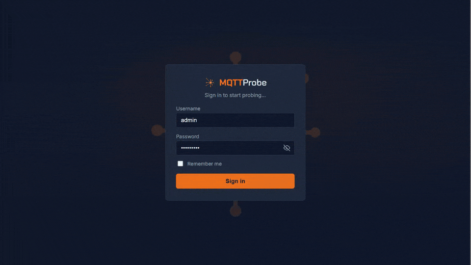
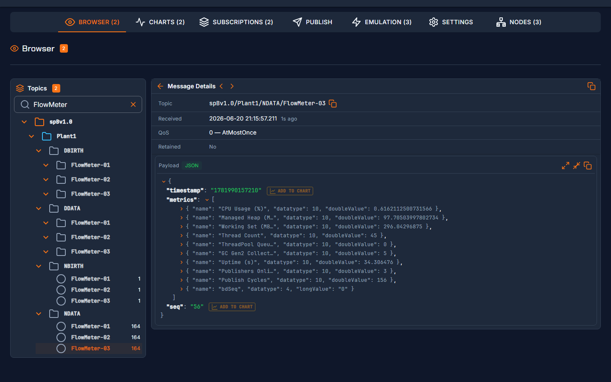

# MQTTProbe

**The MQTT diagnostic tool built for IIoT.**

Connect to any broker, browse live topics, inspect payloads, chart JSON metrics. Native Sparkplug B decode and EoN emulation. Open source, no cloud required.

[](https://github.com/bluegrassiot/mqttprobe/actions/workflows/ci.yml)
[](LICENSE)



## Highlights



- Live topic tree
- Payload browser (JSON, MessagePack, binary)
- Sparkplug B decode and EoN dashboard
- Node and MQTT emulator
- Live charts from payload fields
- Topic exclusions to ignore noisy filters
- Multiple saved connections, TLS/MQTTS, WebSocket
- Plugins (payload formats, protobuf schemas)
- OIDC sign-in on the web host (Keycloak, Authentik, or any OIDC provider)
- Runs local: desktop, Android, Docker, web

## Get MQTTProbe

| Platform | Artifact | Notes |
|----------|----------|-------|
| Windows | [MQTTProbe-win-Setup.exe](https://github.com/bluegrassiot/mqttprobe/releases/latest/download/MQTTProbe-win-Setup.exe) | Per-user, auto-update. SmartScreen: More info, Run anyway |
| macOS | [MQTTProbe-osx-Setup.pkg](https://github.com/bluegrassiot/mqttprobe/releases/latest/download/MQTTProbe-osx-Setup.pkg) | Signed and notarized, auto-update, installs to Applications |
| Linux | [MQTTProbe.AppImage](https://github.com/bluegrassiot/mqttprobe/releases/latest/download/MQTTProbe.AppImage) | `chmod +x` and run. WebKit and GTK are bundled; needs `libfuse2` on Ubuntu 22.04+ |
| Android | [APK on latest release](https://github.com/bluegrassiot/mqttprobe/releases/latest) | `mqttprobe-android-*.apk`; sideload, allow unknown apps if prompted |
| Docker | [bluegrassiot/mqttprobe](https://hub.docker.com/r/bluegrassiot/mqttprobe) | See Docker section |
| iOS | -- | Not available yet |

Portable zips and web self-host builds are on the [latest release page](https://github.com/bluegrassiot/mqttprobe/releases/latest).

## Docker

```bash
docker run -d --name mqttprobe -p 8080:8080 -v mqttprobe-config:/app/config --restart unless-stopped bluegrassiot/mqttprobe:latest
```

No repository checkout is needed. Open http://localhost:8080 and create your admin password on first launch.

Your configuration persists in the `mqttprobe-config` volume across restarts. For LAN access, TLS, reverse proxy, and plugin storage, see the [Docker Deployment wiki](https://github.com/bluegrassiot/mqttprobe/wiki/05-Docker-Deployment).

## After install

Create your admin password, add a broker connection, then subscribe to topics and browse. MQTTProbe connects to one broker at a time; save connection profiles to switch between brokers.

See [Getting Started](https://github.com/bluegrassiot/mqttprobe/wiki/01-Getting-Started) and [Connection Setup](https://github.com/bluegrassiot/mqttprobe/wiki/02-Connection-Setup).

## Docs

- [Home](https://github.com/bluegrassiot/mqttprobe/wiki)
- [Troubleshooting](https://github.com/bluegrassiot/mqttprobe/wiki/06-Troubleshooting)
- [OIDC Authentication](https://github.com/bluegrassiot/mqttprobe/wiki/09-OIDC-Authentication)

Website: https://mqttprobe.com

## Contributing

See [CONTRIBUTING.md](CONTRIBUTING.md) for guidelines on getting started, code style, and the CI pipeline.

## License

Apache License 2.0. See [LICENSE](LICENSE).

Third-party components and their licenses are documented in [NOTICES](NOTICES).
